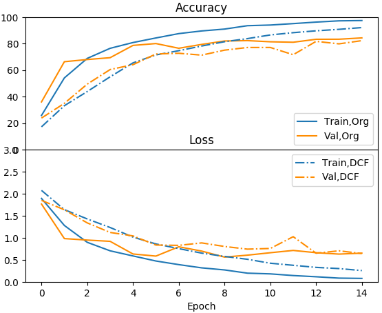

DCFNet-Pytorch
============================
This repository is the pytorch implementation for ICML 2018 paper DCFNet: Deep Neural Network with Decomposed Convolutional Filters

For details please refer to [paper](https://arxiv.org/pdf/1802.04145.pdf).

The code for VGG borrows heavily from [torchvision](https://pytorch.org/docs/stable/torchvision/index.html).

### Files
* `main-lasted.py` is the main file, which has configuration for all models, Resnet, DCF-Based Resnet, VGG and DCF-Based VGG.
```
python main-lasted.py
```
* **To plot**, just use `plotcsv.py`.

###VGG Comparison


### ResNet Comparison

#### Docker Image with Pytorch-0.4.1-cuda9-cudnn7

```sh
docker pull usmanmaqbool/math_dcf:pytorch-0.4.1-cuda9-cudnn7-runtime
sudo nvidia-docker run -it --name leo_math -v /media/leo/0287D1936157598A/docker_ws/docker_ws:/app -e DISPLAY=$DISPLAY -v /tmp/.X11-unix/:/tmp/.X11-unix/ usmanmaqbool/math_dcf:pytorch-0.4.1-cuda9-cudnn7-runtime /bin/bash
```
